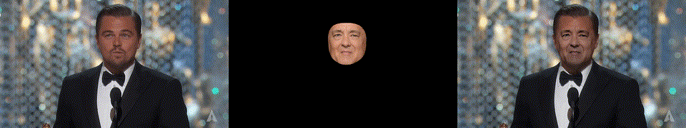
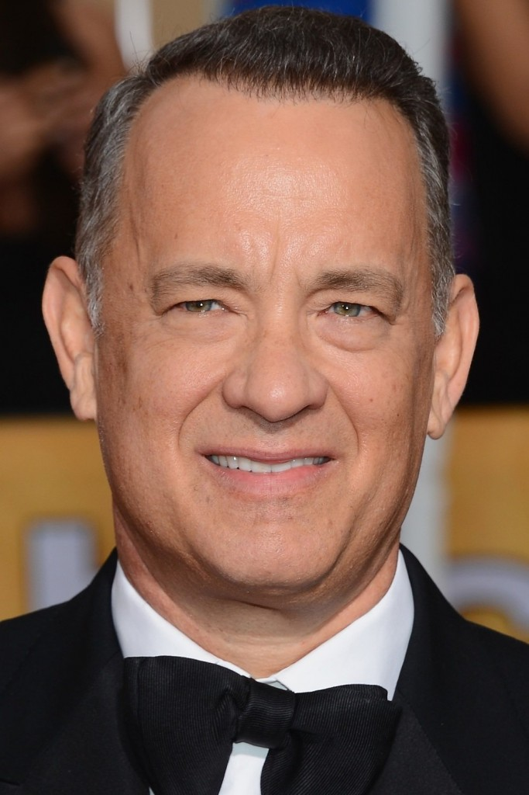
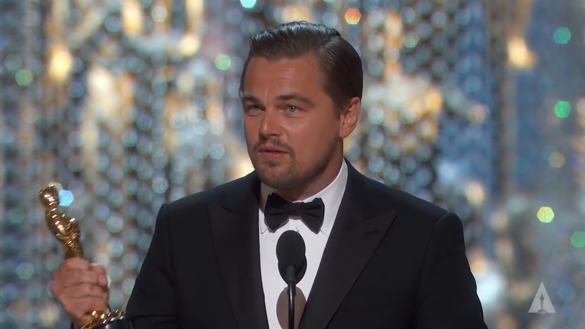
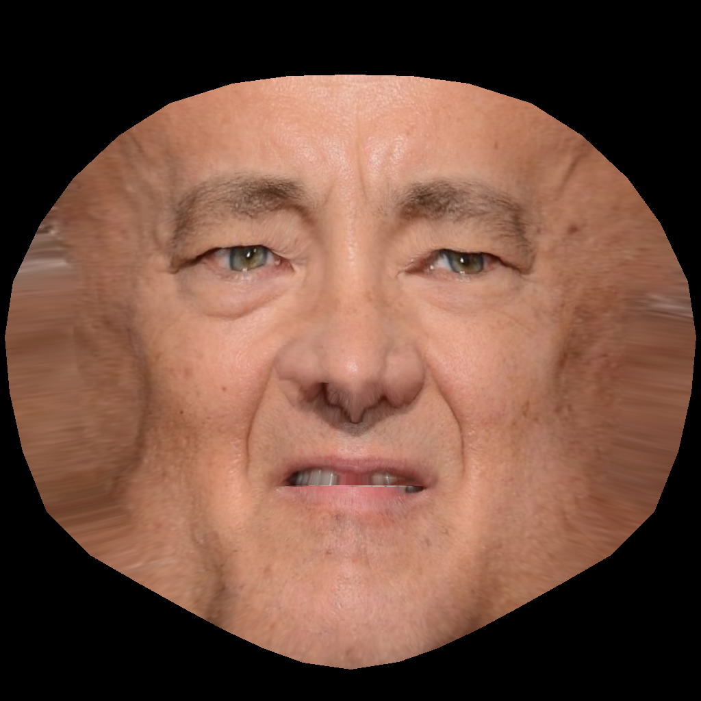
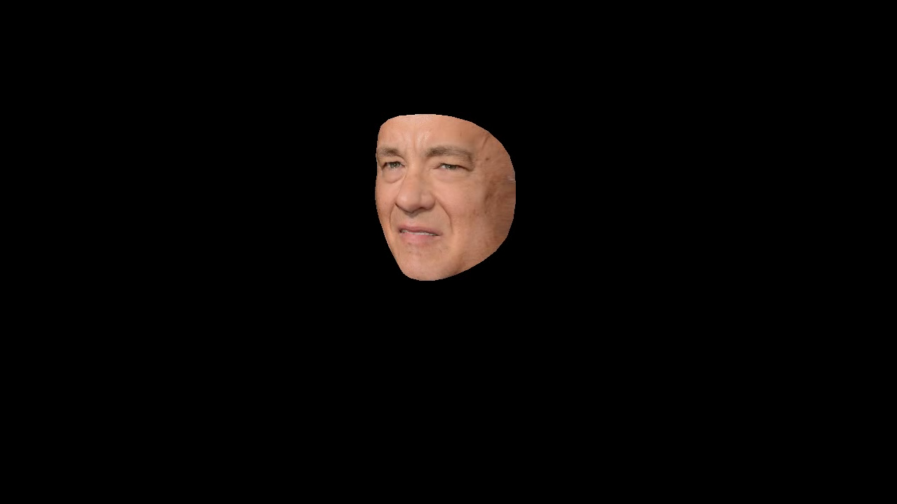
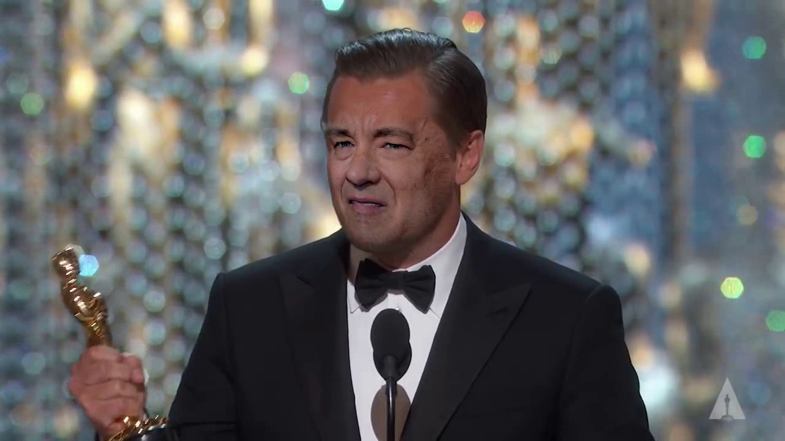

# faceswap_gl
Face swap using Python + OpenGL

This implementation finds facial landmarks on both the source and destination images, and  generates a texture to be used on a 3D model of the face. This Model is then positioned over the destination image using the landmarks.

| Source | Destination | Texture | 3D face | Result |
| ------ | ------- | ----------- | ------------------ | ------ |
|  |  |  |  |  |
